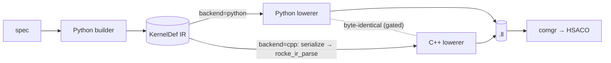

# rocKE Platform Documentation

This folder is a deep, code-adjacent guide to the rocKE platform: the Python
authoring engine and its peer C++ lowering engine for CK Tile-style GPU kernels
on AMDGPU. The package README is the quick tour. These notes are the field
manual: how kernels are described, how the SSA IR works, how the lowering stack
maps operations to AMDGPU LLVM IR and HSACO, what each primitive means, how the
shipped instances execute step by step, what limits matter, and how to validate
changes.

> **Getting started / prerequisites.** New to the DSL? Start with
> [`development/setup_guide.md`](./development/setup_guide.md) — recommended stack
> (**ROCm 7.2 + PyTorch 2.12, Python 3.12**), virtual-environment setup, building
> the optional C++ engine, the environment-variable reference (`ROCKE_BACKEND`,
> `ROCKE_LLVM_FLAVOR`, …), and step-by-step setup for **Linux and Windows**.
> Then follow [`development/onboarding.md`](./development/onboarding.md) to learn
> to author kernels. To reproduce the example READMEs' numbers, use the ROCm 7.2
> stack (older ROCm needs `ROCKE_LLVM_FLAVOR=llvm22` to match a 7.2 comgr).

## Two engines at a glance

rocke has two interchangeable engines (Python authoring + a peer C++ runtime
engine) that emit byte-identical LLVM IR. Select the lowering back end with
`ROCKE_BACKEND` (default `cpp`, auto-falls back to Python if the C++ extension
isn't built; `both` = run both and assert identical).



Full picture (the front-end/back-end matrix, every interconnect, how to switch,
and the hipDNN provider's Fast / JIT / IR-artifact / C-JIT modes):
[`architecture/engines_and_switching.md`](./architecture/engines_and_switching.md).

The implementation tree is:

```text
python/rocke/
├── core/ # SSA IR, IR printer, conservative passes, LLVM/HIP/CK Tile lowering
├── runtime/ # libamd_comgr + libamdhip64 ctypes; launcher, workspace, timing
├── helpers/ # CK Tile-like authoring helpers and the high-level compile entrypoint
├── analysis/ # LLVM IR + HSACO/ISA + resource inspection
├── benchmark/ # repeated-run benchmark summaries (median, spread)
├── instances/ # current spec-driven kernel definitions
├── examples/ # Python-owned example generators and parity harnesses
├── transforms.py # coordinate-transform DAG (pad/embed/unmerge/merge/indirect)
├── run_manifest.py # python -m rocke.run_manifest (HSACO + manifest runner)
├── sweep.py # parallel build-on-the-fly sweep driver
├── sweep_bench.py # benchmark driver over a sweep manifest
└── torch_backend.py # torch.compile backend (rocke.compile)
```

## Reading Order

New to the DSL? Read in this order:

1. [`architecture/mental_model.md`](./architecture/mental_model.md)
2. [`architecture/authoring_model.md`](./architecture/authoring_model.md)
3. [`ir_lowering/ir_model.md`](./ir_lowering/ir_model.md)
4. [`ir_lowering/lowering_pipeline.md`](./ir_lowering/lowering_pipeline.md)
5. [`ir_lowering/backend_details.md`](./ir_lowering/backend_details.md)
6. [`primitives/intrinsics_and_primitives.md`](./primitives/intrinsics_and_primitives.md)
7. [`primitives/memory_layout_and_transforms.md`](./primitives/memory_layout_and_transforms.md)
8. [`primitives/wave_and_cross_lane.md`](./primitives/wave_and_cross_lane.md)
9. [`primitives/quantization.md`](./primitives/quantization.md)
10. [`instances/index.md`](./instances/index.md)
11. [`instances/gemm.md`](./instances/gemm.md)
12. [`instances/convolution.md`](./instances/convolution.md)
13. [`instances/attention.md`](./instances/attention.md)
14. [`instances/small_ops.md`](./instances/small_ops.md)
15. [`runtime/compile_launch_and_manifest.md`](./runtime/compile_launch_and_manifest.md)
16. [`runtime/manifest_schema.md`](./runtime/manifest_schema.md)
17. [`runtime/comgr_and_hipmodule.md`](./runtime/comgr_and_hipmodule.md)
18. [`runtime/limitations.md`](./runtime/limitations.md)
19. [`optimization/optimization_runbook.md`](./optimization/optimization_runbook.md) — current evidence-first optimization workflow
20. [`optimization/runbook_compliance.md`](./optimization/runbook_compliance.md) — code and test anchors for each workflow stage
21. [`optimization/runbook_mapping.md`](./optimization/runbook_mapping.md) — compatibility pointer to the compliance map
22. [`optimization/measured_results.md`](./optimization/measured_results.md) — measurement retention policy and scoped evidence index
23. [`fusion/overview.md`](./fusion/overview.md)
24. [`autotune/overview.md`](./autotune/overview.md)
25. [`development/testing.md`](./development/testing.md)
26. [`development/extending.md`](./development/extending.md)
27. [`development/setup_guide.md`](./development/setup_guide.md) — prerequisites (ROCm 7.2 / PyTorch 2.12), venv setup, building the C++ engine, env-variable reference; Linux & Windows
28. [`development/onboarding.md`](./development/onboarding.md) — guided learning path for kernel authors
29. [`development/engine_contributing.md`](./development/engine_contributing.md) — the dual-backend contract; required reading before editing engine internals
30. [`development/engine_parity.md`](./development/engine_parity.md) — the Python⇄C++ parity rule: every optimization needs both engines (for humans and AI agents)
31. [`development/invariants.md`](./development/invariants.md) — non-obvious rules (the landmines) for engine contributors
32. [`development/troubleshooting.md`](./development/troubleshooting.md) — engine/build failure catalog (stale-artifact class, gate failures)
33. [`reference/file_index.md`](./reference/file_index.md)
34. [`reference/api_index.md`](./reference/api_index.md)
35. [`reference/env_flags.md`](./reference/env_flags.md) — every environment variable (core, provider, tooling, diagnostic)
36. [`reference/op_vocabulary.md`](./reference/op_vocabulary.md)
37. [`reference/mfma_atom_catalog.md`](./reference/mfma_atom_catalog.md)
38. [`reference/glossary.md`](./reference/glossary.md)

## One-Screen Summary

`rocke` lets a kernel author write Python objects and IR-builder calls instead of C++ template metaprogramming. A typical path is:

```text
spec dataclass
 └─> instance builder
 └─> KernelDef SSA IR (core/ir.py)
 ├─> optional passes (core/passes.py)
 ├─> MLIR-style text (core/ir_print.py, for inspection only)
 └─> AMDGPU LLVM IR (core/lower_llvm.py)
 └─> libamd_comgr (runtime/comgr.py)
 └─> HSACO bytes
 └─> hipModuleLoadData -> hipModuleLaunchKernel
 (runtime/hip_module.py + launcher.py)
```

Hard facts:

- The production compile path is **LLVM IR text -> libamd_comgr -> HSACO -> hipModule**. There is no MLIR pipeline at runtime. `print_ir()` emits MLIR-style text for humans only.
- `core/lower_hip.py` (`lower_kernel_to_hip`) is a debugging/inspection backend that emits readable HIP C++. It is not the production runtime path. Op coverage is narrower than LLVM lowering.
- `core/lower_cktile.py` emits CK Tile C++ from selected high-level specs (`UniversalGemmSpec`, `ImplicitGemmConvSpec`). It does not consume `KernelDef`. It exists for parity/reference.
- Default target ISA is `amdgcn-amd-amdhsa--gfx950`. Supported target facts
  come from [`core/arch/target.py`](../python/rocke/core/arch/target.py)
  (`ArchTarget`); instruction selection comes from
  [`core/isa/backend.py`](../python/rocke/core/isa/backend.py).
  [`core/lower_llvm.py`](../python/rocke/core/lower_llvm.py) selects a
  clang-derived data layout by LLVM flavor (`_DATALAYOUT_LLVM20` or
  `_DATALAYOUT_LLVM22`) rather than by architecture.
- Wavefront mode is a compile-time capability of the exact gfx target, not a runtime switch.
  gfx942/gfx950 admit wave64 only; gfx1250 admits wave32 only. gfx1151,
  gfx11-generic, and gfx1201 default to wave32 and can select wave64, but rocKE
  records one validated mode per target in `ArchTarget`. Matrix-atom availability
  is a separate `MmaCatalog` fact; do not infer legal atoms from wave width alone.
- Kernel authors usually compose helpers (`TensorDescriptor`, `TensorView`, `TileWindow`, `MfmaAtom`, `WarpGrid`, `CoalescedTileLoader`, `AsyncTileLoader`, `SchedulePolicy`, `SoftwarePipeline`, `DirectEpilogue`, `CShuffleEpilogue`, `block_lds_reduce`, `sweep_row_chunks`).
- Non-bijective addressing (convolution, paged attention, indirection) is expressed with the transform DAG in `transforms.py`.
- Runtime is persistent: `KernelLauncher` loads HSACO once and is called repeatedly. `PipelineLauncher` chains stages on one stream. `WorkspacePool` keeps long-lived torch workspaces alive across launches. `time_launches` is the canonical HIP-event timer.
- Buffer-resource descriptor DW3 is selected by the exact gfx ISA backend, not
  by a broad accelerator-family label. gfx90a/gfx942/gfx950 use `0x00027000`,
  while gfx11-generic/gfx1151/gfx1201 use `0x31014000`. The gfx1250 backend
  currently inherits `0x31014000` as a bring-up placeholder; its 57-bit
  SRD model still requires target validation. On the established gfx9 and RDNA
  mappings, bounds-checked descriptors make OOB lanes return zero on load and
  drop stores, which is the tail-safe primitive used by conv and attention.
  The same tail-safety behavior is not yet claimed for gfx1250.
- `AsyncTileLoader.choose_dwords` selects `{4, 3, 1}` only (the AMDGPU `raw_ptr_buffer_load_lds` intrinsic on this target does not accept 2 dwords).
- `Value.__bool__` raises by design. SSA values cannot drive Python branches; use `IRBuilder.static_if(...)` for Python booleans and `IRBuilder.scf_if(...)` for runtime predicates.

## Validation Status

The docs in this folder are written against the current code. Run commands
from the `rocke/platform/` root with the Python interpreter for your ROCm environment:

```bash
export PYTHONPATH=python

PYTHONDONTWRITEBYTECODE=1 python tests/test_rocke.py

OUT_DIR="${OUT_DIR:-$(mktemp -d)}"
python -m rocke.examples.common.bake_off_implicit_gemm --output-dir "$OUT_DIR"
python -m rocke.run_manifest "$OUT_DIR"/*.hsaco "$OUT_DIR"/manifest.json --verify
```

See [`development/testing.md`](./development/testing.md) for the full procedure
and [`optimization/measured_results.md`](./optimization/measured_results.md) for
the evidence-retention policy and index of properly scoped experiment records.

## Source Material

These docs are written against the current code. When this file and code disagree,
trust code. The most important source files are listed in
[`reference/file_index.md`](./reference/file_index.md).

Conventional anchors:

- Package re-exports: [`python/rocke/__init__.py`](../python/rocke/__init__.py),
  [`python/rocke/helpers/__init__.py`](../python/rocke/helpers/__init__.py).
- IR + builder: [`python/rocke/core/ir.py`](../python/rocke/core/ir.py).
- Production lowering:
  [`python/rocke/core/lower_llvm.py`](../python/rocke/core/lower_llvm.py).
- HIP debug lowering:
  [`python/rocke/core/lower_hip.py`](../python/rocke/core/lower_hip.py).
- CK Tile parity emission:
  [`python/rocke/core/lower_cktile.py`](../python/rocke/core/lower_cktile.py).
- Conservative passes:
  [`python/rocke/core/passes.py`](../python/rocke/core/passes.py).
- COMGR: [`python/rocke/runtime/comgr.py`](../python/rocke/runtime/comgr.py).
- HIP runtime:
  [`python/rocke/runtime/hip_module.py`](../python/rocke/runtime/hip_module.py).
- Launcher / workspace / timing:
  [`python/rocke/runtime/launcher.py`](../python/rocke/runtime/launcher.py).
- Kernel arg packing:
  [`python/rocke/runtime/packing.py`](../python/rocke/runtime/packing.py).
- High-level compile:
  [`python/rocke/helpers/compile.py`](../python/rocke/helpers/compile.py).
- Manifest schema:
  [`python/rocke/helpers/manifest.py`](../python/rocke/helpers/manifest.py).
- Optimization runbook:
  [`dsl_docs/optimization/optimization_runbook.md`](./optimization/optimization_runbook.md).
- DSL runbook compliance table:
  [`dsl_docs/optimization/runbook_compliance.md`](./optimization/runbook_compliance.md).
- Coordinate-transform DAG walkthrough:
  [`dsl_docs/architecture/transform_dag.md`](./architecture/transform_dag.md).
- Helpers reference:
  [`python/rocke/helpers/README.md`](../python/rocke/helpers/README.md).
