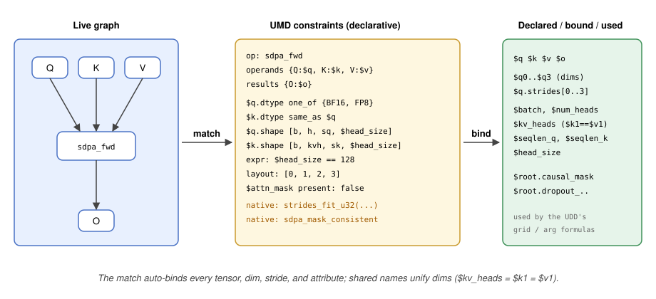
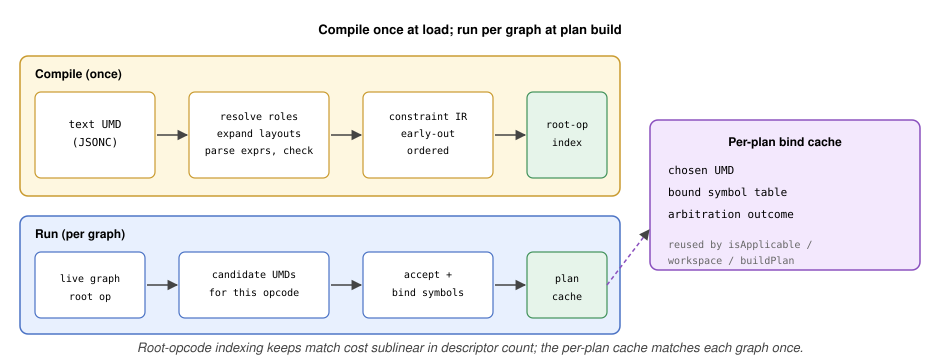

# RFC 0018: Universal Match Descriptor (UMD) and the Graph Matcher

- Contributors: Brian Harrison

> Follow-up to [RFC 0017 (Universal Kernel Descriptors)](0017_UniversalKernelDescriptor.md),
> the "UMD + graph matcher" row of its follow-up series ([RFC 0017 §12.2](0017_UniversalKernelDescriptor.md#122-follow-up-rfcs)).
> This RFC designs the match format and the matcher; the sibling formats (UDD, UED, UHD, KDP) and
> subsystems (packaging, drop-in, adapters) are designed in their own follow-ups and are referenced,
> not redesigned, here. The RFC number is provisional and is reconciled against the concurrent
> follow-up series at PR-open time.

## Table of Contents

1. [Overview](#1-overview)
2. [The Matcher's Input: hipDNN's Graph Model](#2-the-matchers-input-hipdnns-graph-model)
3. [Structural Pattern](#3-structural-pattern)
4. [Symbol Binding and the Auto-Binding Formula](#4-symbol-binding-and-the-auto-binding-formula)
5. [Constraint Vocabulary](#5-constraint-vocabulary)
6. [The Shared Expression Language](#6-the-shared-expression-language)
7. [Layout and Stride-Order Constraints](#7-layout-and-stride-order-constraints)
8. [Native-Predicate Escape Hatch](#8-native-predicate-escape-hatch)
9. [Composite Constraints](#9-composite-constraints)
10. [The Matcher: Compilation, Indexing, and Caching](#10-the-matcher-compilation-indexing-and-caching)
11. [Static Matcher (Sketch)](#11-static-matcher-sketch)
12. [Arbitration](#12-arbitration)
13. [Serialization and Versioning](#13-serialization-and-versioning)
14. [Security and Hostile Input](#14-security-and-hostile-input)
15. [Observability and Diagnostics](#15-observability-and-diagnostics)
16. [Testing and Performance](#16-testing-and-performance)
17. [Migration](#17-migration)
18. [Worked Example: SDPA Forward](#18-worked-example-sdpa-forward)
19. [Risks](#19-risks)
20. [Open Questions](#20-open-questions)
21. [References and Prior Art](#21-references-and-prior-art)
22. [Glossary](#22-glossary)
23. [Appendix A: Schema Reference](#appendix-a-schema-reference)
24. [Appendix B: Op-Schema Registry Generation](#appendix-b-op-schema-registry-generation)

---

## 1. Overview

A **UMD (Universal Match Descriptor)** is the declarative data that decides whether a kernel applies to
an incoming problem graph, and, in the same pass, binds the named variables that the kernel's dispatch
and workspace formulas reference. It replaces the graph half of a hand-coded
`IPlanBuilder::isApplicable` check ([RFC 0017 §2](0017_UniversalKernelDescriptor.md#2-the-descriptors)).
One UMD is authored once and referenced by ID; a KDP lists a set of matcher IDs and a kernel applies
only when all pass ([RFC 0017 §5](0017_UniversalKernelDescriptor.md#5-matching-and-the-umd)), so a
family of near-identical kernels shares a handful of matchers rather than carrying a bespoke C++ check
each.

A UMD has two parts, unchanged in intent from
[RFC 0017 §5](0017_UniversalKernelDescriptor.md#5-matching-and-the-umd):

1. A **structural pattern**: named operation nodes and their named operand and result edges. Because
   hipDNN op graphs are DAGs, the pattern is an explicit node-and-edge graph, not a nested expression.
2. A **criteria expression** over the pattern's bound variables: one JsonLogic boolean, typically an
   `and` of the individual tests.

This document turns that frame into a concrete format and a concrete matcher. It specifies the pattern
and criteria schema, the standard formula that auto-binds every tensor and attribute of a matched op,
JsonLogic as the shared expression language (boolean criteria here, dispatch formulas in the UDD),
the layout representation as a stride-order index array, the custom-operation escape hatch,
deterministic arbitration, and the compile-once matcher with its indexing and caching. The static
(compile-time) matcher is sketched as options, not fully designed, in this iteration.

### 1.1 What This RFC Specifies Versus Defers

| Capability | This RFC (day-one) | Deferred |
|---|---|---|
| Structural pattern: op nodes, named operand/result edges, single-op and bounded fused subgraphs | Yes ([§3](#3-structural-pattern)) | None |
| Auto-binding of every operand/result tensor, its dims and strides, and every op attribute | Yes ([§4](#4-symbol-binding-and-the-auto-binding-formula)) | None |
| Criteria as one JsonLogic expression: opcode, dtype (exact/set/relation), shape/rank, divisibility, stride order, packed, attribute, graph-structure (`node_count`, `virtual`), cross-tensor relation, optional operand, device property | Yes ([§5](#5-constraint-vocabulary)) | None |
| JsonLogic as the shared expression language (UMD boolean + UDD value), `$`-variable convention | Yes ([§6](#6-the-shared-expression-language)) | New operators as needed |
| Layout as a stride-order index array, with named aliases | Yes ([§7](#7-layout-and-stride-order-constraints)) | None |
| Custom-operation (native-predicate) escape hatch, registry-resolved | Yes ([§8](#8-native-predicate-escape-hatch)) | None |
| Composite criteria: `(A AND B) OR C` as one criteria expression, via JsonLogic `and`/`or`/`!`/`if` | Yes ([§9](#9-composite-constraints)) | None |
| Compile-once matcher, root-opcode index, per-plan match cache | Yes ([§10](#10-the-matcher-compilation-indexing-and-caching)) | None |
| Static (compile-time / AOT-lowered) matcher | Options sketched ([§11](#11-static-matcher-sketch)) | Full design |
| General N-ary commutative matching, unbounded variable-length chains | None | JIT follow-up ([RFC 0017 §8.3](0017_UniversalKernelDescriptor.md#83-future-jit-and-normalized-providers)) |

---

## 2. The Matcher's Input: hipDNN's Graph Model

The matcher reads an immutable graph through the existing `IGraph` interface
(`projects/hipdnn/flatbuffers_sdk/include/hipdnn_flatbuffers_sdk/flatbuffer_utilities/GraphWrapper.hpp`)
plus the HIP stream for device properties. Three properties of that model drive the design.

**The graph is UID-centric, not edge-centric.** A `Node` carries only `{name, compute_data_type,
attributes_type, attributes}` (`graph_generated.h`, Node table). It has no input or output tensor
lists. A node's operands and results are UID fields inside its concrete attribute table, for example
`SdpaAttributes::q_tensor_uid()`, `k_tensor_uid()`, `o_tensor_uid()` (`sdpa_attributes_generated.h`).
Connectivity between nodes is implicit: two nodes are connected when a result UID of one appears as an
operand UID of the other. To resolve a node's edges, the matcher must know the op type, cast via
`attributesAs<T>()`, and read the named UID fields.

**Consequence: the matcher needs an op-schema registry.** For each op type, the registry declares which
attribute fields are operand UIDs, which are result UIDs, whether each is required or optional, and the
names of the op's scalar attributes. This registry is what lets a UMD reference operands and results
by name (`q`, `k`, `v`, `o`) and what powers the auto-binding formula of
[§4](#4-symbol-binding-and-the-auto-binding-formula).

**The registry is generated from schema annotations, not name conventions.** A table-level FlatBuffers
attribute names the op, and field-level attributes on each op's attribute table declare the binding
contract next to the field they govern. `umd_opcode` on the attribute table gives the op's UMD-facing
opcode (`SdpaAttributes (umd_opcode: "sdpa_fwd")`); a UMD node's `op` names it, and the registry keys
on it (falling back to the table type name when the attribute is absent), so the schema is the single
source of truth for the opcode rather than an ad-hoc string. `umd_input_tensor` / `umd_output_tensor`
mark a UID field and `umd_name` names it, so SDPA's Q operand is
`q_tensor_uid: long (umd_input_tensor, umd_name: "q")` and its O result is
`o_tensor_uid: long (umd_output_tensor, umd_name: "o")`. Optionality is not re-annotated:
a UID field's `= null` default already encodes it (`attn_mask_tensor_uid: long = null`), and the
`NodeAttributes` union already maps each opcode to its table, so every unannotated *scalar* field is a
scalar attribute by elimination (unannotated non-scalar fields — vectors, sub-tables — are not
bindable scalars and are skipped). A build step emits the binary
reflection schema (`graph.bfbs`, which transitively covers every attribute table; custom attributes
surface only through reflection, not the generated headers) and a generator reads each field's
attributes to emit the registry, so it stays in lockstep with the graph definitions rather than being
hand-maintained ([Appendix B](#appendix-b-op-schema-registry-generation) specifies the annotation contract, the field-classification rules, and the generation pipeline). Names are never inferred from the `_tensor_uid` name suffix, which would misclassify
non-UID fields such as `PointwiseAttributes::axis_tensor_uid` (a plain axis index, not a tensor UID).

**Tensors expose dims, strides, dtype, and a virtual flag, but no layout enum and no rank field.**
`TensorAttributes` (`tensor_attributes_generated.h`) offers `dims()`, `strides()` (both nullable
vectors), `data_type()`, `uid()`, and `virtual_()`. Rank is `dims()->size()`. Layout is not stored; it
is derived from the stride order, which is why the UMD represents layout as a stride-order index array
([§7](#7-layout-and-stride-order-constraints)). Quantities like `head_size`, `batch`, and `num_heads`
are **not** attributes; they are specific tensor dims (for SDPA, `q.dims[3]`, `q.dims[0]`, `q.dims[1]`).
The UMD binds them as named shape dims (`$q.head_size`), not as attribute reads, matching RFC 0017's
`shape` short-hand ([§4](#4-symbol-binding-and-the-auto-binding-formula)).

**Device and arch are out-of-band.** The graph carries no device identity. Arch comes from the stream
via `getDeviceString(handle.getStream())` (`HipDeviceUtils.hpp:48`); for AOT it gates *pack selection*,
not a match criterion ([§5](#5-constraint-vocabulary)). Other device properties resolve against the
`Handle` the matcher receives alongside the graph, read as `$device.<field>` rather than a graph field.

**Graph guarantees the matcher may rely on.** Per the `IGraph` contract the graph is topologically
sorted, acyclic, fully connected, and has unique tensor UIDs. The matcher builds its own
UID-to-producer and UID-to-consumers index once per graph to walk edges and reconstruct connectivity,
since no adjacency query is provided; fusion legality reads each intermediate's `virtual` flag.


---

## 3. Structural Pattern

The pattern is a set of op nodes and the named edges between them and the graph's tensors. Each node
declares its opcode and maps operand and result **names** (from the op-schema registry) to pattern
variables (`$q`, `$conv_out`).

```jsonc
{
  "schema": "hipdnn.umd/v1",
  "id":   "9c3f5b2a-7d41-4e88-b6a0-1f2e3d4c5b6a",
  "name": "SDPA forward (d128, bf16) match",
  "nodes": [
    {"kind": "op", "id": "sdpa_fwd", "op": "sdpa_fwd",
     "operands": {"Q": "$q", "K": "$k", "V": "$v"}, "results": {"O": "$o"}}
  ],
  "criteria": { /* Section 6: one JsonLogic boolean expression */ }
}
```

- **Node identity.** Each node has a pattern-local `id` (`sdpa_fwd`, `conv`, `add`) used to read the
  node's attributes (`$<id>.<attr>`, [§4](#4-symbol-binding-and-the-auto-binding-formula)) and in
  diagnostics. It is distinct from the descriptor's global `id`.
- **Opcode.** `op` names one opcode — the op's `umd_opcode` shorthand from the schema
  ([§2](#2-the-matchers-input-hipdnns-graph-model), [Appendix B](#appendix-b-op-schema-registry-generation)),
  e.g. `sdpa_fwd` — or `{"one_of": [...]}` for a small fixed set, or `"any"` for a wildcard node (used
  only inside a bounded fused pattern).
- **Names.** Keys in `operands` and `results` are op-schema tensor names; values are pattern variables.
  A name the schema marks optional is bound with a `?` suffix (`"attn_mask": "$attn_mask?"`), bound only
  when the graph supplies it, and read with a default via `value_or_default`
  ([§4](#4-symbol-binding-and-the-auto-binding-formula)). Names not listed are ignored for matching but
  still auto-bound.
- **Edges are implicit through shared variables.** Two nodes are connected when the same variable
  appears as a result of one and an operand of another. In the fused example below, `$conv_out` is
  `conv`'s result and `add`'s operand, which is the edge.
- **Subgraph matching by default; exact match is explicit.** The pattern matches a connected subgraph,
  which may sit inside a larger graph. A prebuilt kernel that is the whole graph pins the exact op count
  with `{"==": ["$graph.node_count", N]}` ([§5](#5-constraint-vocabulary)): a single-op kernel checks
  `node_count == 1`, replacing the `nodeWrappers().size() != 1` gate; a fused three-op kernel checks
  `node_count == 3`. Matching a pattern inside a larger graph without a fixed count is the looser JIT
  mode ([RFC 0017 §8.3](0017_UniversalKernelDescriptor.md#83-future-jit-and-normalized-providers)).
- **Override-shape graphs** are declined by default (mirroring today's gate); a UMD that supports them
  sets `"allow_override_shape": true` at the top level.

**Fusion is day-one.** A multi-node pattern binds the whole fused subgraph at once and hands it to one
UKD. Legality — that the fused intermediates are absorbed into the kernel, not consumed outside it — is
expressed by requiring each intermediate `virtual` and pinning the op count with `$graph.node_count`:

```jsonc
{
  "schema": "hipdnn.umd/v1",
  "id":   "2b7e1c44-9a0d-4f13-8c21-6e5d4a3b2c10",
  "name": "Conv-Bias-ReLU (NHWC, f16) match",
  "nodes": [
    {"kind": "op", "id": "conv", "op": "convolution_fwd",
     "operands": {"X": "$x", "W": "$w"},           "results": {"Y": "$conv_out"}},
    {"kind": "op", "id": "bias", "op": "pointwise_add",
     "operands": {"A": "$conv_out", "B": "$bias"},  "results": {"Y": "$bias_out"}},
    {"kind": "op", "id": "act",  "op": "pointwise_relu",
     "operands": {"A": "$bias_out"},                "results": {"Y": "$y"}}
  ],
  "criteria": {"and": [
    {"==": ["$x.dtype", "FLOAT16"]}, {"==": ["$x.stride_order", [0, 2, 3, 1]]}, "$x.packed",  // NHWC
    {"==": ["$y.dtype", "FLOAT16"]}, {"==": ["$y.stride_order", [0, 2, 3, 1]]}, "$y.packed",  // NHWC
    {"shape": ["$y",    ["batch", "out_h", "out_w", "out_channels"]]},
    {"shape": ["$bias", ["out_channels"]]},
    {"==": ["$graph.node_count", 3]},              // exactly these three ops
    "$conv_out.virtual", "$bias_out.virtual"       // intermediates absorbed by the fused kernel
  ]}
}
```

Out of scope for this iteration, as in [RFC 0017 §5](0017_UniversalKernelDescriptor.md#5-matching-and-the-umd):
general N-ary commutative matching and unbounded variable-length chains. Bounded commutative pairs and
bounded optional slots cover the fusion cases a prebuilt kernel needs.

---

## 4. Symbol Binding and the Auto-Binding Formula

Matching does double duty: it decides applicability and it binds named variables. A symbol is
**declared** in the UMD, **bound** when the graph matches, and **used** by the UDD's dispatch and
workspace formulas ([RFC 0017 §6](0017_UniversalKernelDescriptor.md#6-dispatch-and-workspace)). Every
symbol a formula references must be bound by the match, so a formula can only read values the match
actually produces. The UMD publishes its bound-symbol set; each UKD that pairs this UMD with a UDD is
checked at build and at drop-in load, and a UDD that references an unbound symbol is rejected then
rather than failing closed later on a live graph.

**Auto-binding is the default, and follows a standard formula (AICK-1698).** When a pattern names an
operand or result variable, the matcher, using the op-schema registry, automatically binds it and its
fields, so authors get a complete symbol table for free and never hand-declare each field. Every field a
criteria or dispatch expression may reference falls in one of **five namespaces**, and the hipDNN schema
declares them so the interpreter fails closed on anything undeclared:

- **Tensor** — a bound operand/result and its fields: `$q` is the whole tensor (the matched
  `TensorAttributes`) and `$q.uid` its graph UID; each
  dim positionally as `$q.dims[i]` and by name as `$q.<dim>` once a `shape` names it (`$q.seqlen_q`);
  each stride as `$q.strides[i]`; and the derived facts `$q.rank`, `$q.dtype`, `$q.stride_order`
  ([§7](#7-layout-and-stride-order-constraints)), `$q.packed`, and `$q.virtual` (an internal
  intermediate between matched nodes, not a graph input or output). An optional operand also carries
  `$q.present`, true only when the graph supplies it.
- **Graph** — structural facts of the matched graph, chiefly `$graph.node_count`, which pins an exact
  match ([§3](#3-structural-pattern)).
- **Attributes** — a matched node's scalar attributes, named by the node's pattern `id`: an
  `{"id": "sdpa_fwd"}` node exposes `$sdpa_fwd.dropout_probability`, a `{"id": "conv"}` node
  `$conv.dilation`. An optional attribute carries `$sdpa_fwd.<attr>.present`.
- **Kernel metadata** — `$kernel.<field>`, the values a UKD supplies for the fields its KMD declares
  (tile and vector constants, the dtype it targets, [RFC 0017 §4](0017_UniversalKernelDescriptor.md#4-descriptor-formats));
  a matcher that reads them is evaluated per kernel ([§10](#10-the-matcher-compilation-indexing-and-caching)).
- **Device properties** — `$device.<field>` such as `$device.lds_size` or `$device.warp_size`, for a
  check like an LDS budget. Architecture is **not** here for AOT: it is a pack property gated at
  selection ([§2](#2-the-matchers-input-hipdnns-graph-model)); a JIT pack may reference `$device.arch`.

**A `$` marks a reference.** Every reference to a bound field carries a leading `$`: tensors and
their fields (`$q`, `$q.uid`, `$q.dims[2]`, `$q.rank`, `$q.seqlen_q`), a node's attributes (`$sdpa_fwd.head_size`
— the node id `sdpa_fwd` is bare, the reference carries the `$`), `$graph.node_count`, `$kernel.tile_m`,
and `$device.lds_size`. Tokens without a `$` are literals: numbers, enum values (`"BFLOAT16"`,
`"gfx942"`), opcodes, and layout aliases. This is the JsonLogic variable rule of
[§6](#6-the-shared-expression-language): a `$`-string is a variable, everything else a literal, so no
`var` wrapper is needed and the same token reads identically in a criteria expression or a
custom-operation argument.

**Named dims via the `shape` short-hand.** `shape` is a criteria short-hand that names a tensor's dims
and pins its rank to the list length: `{"shape": ["$q", ["batch", "num_heads", "seqlen_q", "head_size"]]}`
makes those dims readable as `$q.batch` … `$q.head_size` and requires `$q` to be rank 4. Names are
per-tensor, so a cross-tensor relation (same head dim across q/k) is an explicit criterion,
`{"==": ["$k.head_size", "$q.head_size"]}`, or a custom operation. A dim position may be left anonymous
with `"_"`. When rank varies (NCHW vs NCDHW), name the fixed dims and capture the variable run as one
vector, `["n", "c", "$spatial"]`, so one matcher accepts both ranks and still reaches those dims through
`all` or a product; the exact `shape` grammar is specified in [Appendix A.5](#a5-the-shape-short-hand).



---

## 5. Constraint Vocabulary

The `criteria` field is a **single JsonLogic boolean expression** evaluated over the bound symbol table
([§4](#4-symbol-binding-and-the-auto-binding-formula), [§6](#6-the-shared-expression-language)). It is
normally an `and` of the individual tests, and reaches for `or` / `!` / `if` wherever a real
disjunction is needed ([§9](#9-composite-constraints)). The table below is not a set of criterion
*kinds* (there are none); it is the set of hand-written checks and the
JsonLogic sub-expression that expresses each, so no check needs code a JsonLogic expression cannot
state. The one residue is a **custom operation** (native predicate), itself a JsonLogic operation
resolved from the provider registry ([§8](#8-native-predicate-escape-hatch)), so it composes inside the
same expression as any built-in operator.

| Hand-written check | JsonLogic criterion | Lowers from |
|---|---|---|
| **Opcode** | in the pattern node `op` (exact, `one_of`, `any`), not a criterion | node attribute-type gate |
| **Dtype (exact / set)** | `{"==": ["$q.dtype", "BFLOAT16"]}` / `{"in": ["$q.dtype", ["BFLOAT16", "FP8_E4M3"]]}` | `validateDataTypeIsSupported`, `validateFixedDataType` |
| **Dtype (relation)** | `{"==": ["$k.dtype", "$q.dtype"]}` | `validateConsistentDataTypes`, `q == k == v` |
| **Rank** | `{"==": ["$q.rank", 4]}`, or a `shape` short-hand that names four dims | `validateDimensionCount`, rank == 4 |
| **Shape (bind / relate)** | `{"shape": ["$q", ["batch", "num_heads", "seqlen_q", "head_size"]]}` binds `$q.<dim>`; relate with `{"==": ["$q.head_size", "$k.head_size"]}` | dim reads and cross-tensor dim relations |
| **Divisibility** | `{"divisible": [{"*": ["$y.n", "$y.ho", "$y.wo"]}, "$kernel.MPerBlock"]}` | tile-fit / GEMM-dim gates |
| **Layout** | `{"==": ["$q.stride_order", [0, 1, 2, 3]]}` ([§7](#7-layout-and-stride-order-constraints)) | `validateSupportedLayout` |
| **Packing** | `"$q.packed"` (a bound boolean) | `validatePackedTensors` |
| **Cross-tensor layout** | `{"==": ["$x.stride_order", "$y.stride_order"]}` (per pair) | `validateConsistentLayouts` |
| **Attribute (value)** | `{"==": ["$sdpa_fwd.causal_mask", false]}`; absent-or `{"or": [{"!": "$sdpa_fwd.dropout_probability.present"}, {"==": ["$sdpa_fwd.dropout_probability", 0.0]}]}` | per-attr value gates |
| **Attribute (one_of)** | `{"in": ["$sdpa_fwd.head_dim", [64, 128, 192]]}` | `head_dim in {...}` |
| **Optional operand present/absent** | operand `?` in the pattern; `{"!": "$attn_mask.present"}` (absent) / `"$bias.present"` (present) | `attn_mask_tensor_uid()` absent gate |
| **Graph structure (exact / fusion)** | `{"==": ["$graph.node_count", 3]}`, and each intermediate `"$conv_out.virtual"` | node-count gate, fusion legality |
| **Cross-tensor / arithmetic** | `{"==": ["$q.dims[1]", "$k.dims[2]"]}`, `{"<": ["$q.head_size", 129]}`, `{"==": [{"%": ["$q.num_heads", "$k.kv_heads"]}, 0]}` | arithmetic and comparison gates |
| **Device property** | `{"<=": ["$kernel.lds_per_block", "$device.lds_size"]}` (arch is a pack property, not a criterion) | LDS/occupancy budgets; `getDeviceString` arch → pack `arch` |
| **Custom operation** | `{"hipdnn.strides_fit_u32": ["$q", "$k", "$v", "$o"]}` ([§8](#8-native-predicate-escape-hatch)) | overflow guards, table lookups, derived-shape relations |

Architecture gates *applicability* at pack selection via the KDP `arch` property and the per-arch
`kpack` manifest ([RFC 0017 §5](0017_UniversalKernelDescriptor.md#5-matching-and-the-umd),
[§9](0017_UniversalKernelDescriptor.md#10-packaging-and-delivery)), not as a match-time criterion for
AOT; other device properties (`$device.lds_size`, `$device.warp_size`) are read directly in criteria.

---

## 6. The Shared Expression Language

Every UMD criterion and every UDD dispatch formula is a **JsonLogic** expression: a nested
`{"op": [args]}` tree whose arguments are themselves expressions or literals (the criteria-expression
form of [RFC 0017 §5](0017_UniversalKernelDescriptor.md#5-matching-and-the-umd)). Descriptors stay pure
data, and one parser, validator, and interpreter serve both subsystems. This RFC pins JsonLogic as the
concrete form RFC 0017 §5/§6 left to the follow-ups; the UDD follow-up adopts the same core.

**The `$`-variable convention.** Stock JsonLogic reads a bound value with `{"var": "path"}`. This RFC
replaces that with a single rule: **any string that begins with `$` is a variable reference** into the
bound symbol table ([§4](#4-symbol-binding-and-the-auto-binding-formula)) — `"$q"`, `"$q.dims[3]"`,
`"$q.seqlen_q"`, `"$q.dtype"`, `"$q.stride_order"`, `"$sdpa_fwd.head_size"`, `"$graph.node_count"`,
`"$kernel.tile_m"`, `"$device.lds_size"`. Every other JSON scalar is a literal: numbers (`128`),
booleans (`false`), and non-`$` strings (`"BFLOAT16"`, `"gfx942"`). There is no ambiguity, so no
`{"var": ...}` wrapper is used or accepted. A bare `$`-string is itself a valid boolean criterion when
it names a boolean field, e.g. `"$q.packed"`.

**Two uses, one language.**

- **Criteria (UMD).** A boolean-valued expression that decides applicability; a criterion that does not
  evaluate to a boolean is a compile error.
- **Dispatch formulas (UDD).** A value-valued expression for grid, block, shared memory, and workspace
  ([RFC 0017 §6](0017_UniversalKernelDescriptor.md#6-dispatch-and-workspace)), yielding a number.

**Operators.** Logical `and`, `or`, `!`; comparison `==`, `!=`, `<`, `<=`, `>`, `>=`; membership `in`;
the per-element `all`; arithmetic `+`, `-`, `*`, `/`, `%`; the pattern/short-hand ops `shape`, `rank`,
`divisible`, and `value_or_default` (reads a possibly-absent optional operand with a default); the
conditional `if`; and the value-core arithmetic the UDD needs (`ceil_div`, `min`, `max`, `abs`, `pow`,
`log2`, `rsqrt`). Anything the built-ins cannot express is a **custom operation**
([§8](#8-native-predicate-escape-hatch)). Adding an operator is additive
([§13](#13-serialization-and-versioning)); it never introduces a new criterion *kind*, since the whole
`criteria` field is one JsonLogic expression.

```jsonc
// criteria (boolean): sub-expressions of the single top-level criteria expression
{"==": ["$q.head_size", 64]}                                // dim equality (named dim)
{"==": ["$q.dims[1]", "$k.dims[2]"]}                        // cross-tensor dim relation (positional)
{"<=": ["$q.head_size", 128]}                               // range bound
{"in": ["$q.head_size", [64, 128, 256]]}                    // set membership
{"divisible": ["$q.num_heads", "$k.kv_heads"]}             // GQA divisibility
{"==": ["$q.stride_order", [0, 1, 2, 3]]}, "$q.packed"      // layout + packed
{"==": ["$graph.node_count", 1]}                            // exact whole-graph match
{"or": [{"!": "$attn_mask.present"},
        {"==": ["$attn_mask.dtype", "$q.dtype"]}]}          // composition (§10)

// dispatch formulas (value), reused by the UDD
{"ceil_div": ["$q.seqlen_q", 16]}
{"*": [{"rsqrt": ["$q.head_size"]}, 1.4426950408889634]}
```

**Evaluation is a safe, bounded interpreter.** It fails closed on an unknown symbol, an out-of-range
axis, a type error, a non-boolean criterion result, or an invalid operation, and never executes
arbitrary code. Integer arithmetic uses checked-width integers and fails closed on overflow rather than
wrapping ([§14](#14-security-and-hostile-input)). The interpreter is bounded in recursion depth and step
count. Because JsonLogic is tiny and the evaluator is hand-written (no third-party parser), it is small
enough to audit and to lower into the static matcher ([§11](#11-static-matcher-sketch)).

---

## 7. Layout and Stride-Order Constraints

hipDNN tensors store no layout enum; layout is implied by stride order
([§2](#2-the-matchers-input-hipdnns-graph-model)). The UMD therefore represents layout as an **array of
dimension indexes giving the stride order**, from the slowest-varying dimension to the
fastest-varying. This is the shape a matcher can check directly against `strides()` and matches how
`TensorDescriptor` already precomputes `strideOrder` (`ApplicabilityChecks.cpp:17`).

```jsonc
{"==": ["$q.stride_order", [0, 1, 2, 3]]}   // natural order (BHSD, rank-4)
{"==": ["$x.stride_order", [0, 2, 3, 1]]}   // NHWC over an NCHW logical dim order
```

- The array is a permutation of `0..rank-1`. Entry `k` names the logical dimension that occupies stride
  position `k`, so `[0,1,2,3]` is descending-stride packed and `[0,2,3,1]` places the channel dim last
  (NHWC). The `axis` used everywhere else (dims, strides, `args_signature`) indexes the logical
  dimension order, independent of this physical layout, consistent with RFC 0017 §6.
- **Named aliases** are provided for the common cases and expand to the array literal at compile time,
  so `{"==": ["$x.stride_order", "nhwc"]}` compiles to a comparison against `[0, 2, 3, 1]`:
  `"nchw" -> [0,1,2,3]`, `"nhwc" -> [0,2,3,1]`, `"ncdhw"`, `"ndhwc"`, `"bhsd" -> [0,1,2,3]`,
  `"contiguous"` (identity permutation for the tensor's rank). The array remains the single canonical
  form. The alias set matches the layouts `validateSupportedLayout` accepts today
  (`ApplicabilityChecks.cpp:77`).
- **Cross-tensor consistency** is a JsonLogic equality between stride orders,
  `{"==": ["$x.stride_order", "$y.stride_order"]}` (one per pair, joined by the top-level `and`),
  lowering `validateConsistentLayouts`; layout-agnostic tensors (rank-1 scalars, pass-by-value) are
  skipped as they are today.
- **Packing** is the separate bound boolean `$q.packed` (written `"$q.packed"`), since a supported
  stride order does not imply the tensor is gap-free; it lowers `validatePackedTensors`.
- `$q.stride_order` is an ordinary bound value ([§4](#4-symbol-binding-and-the-auto-binding-formula)),
  so a `stride_order == [0,1,2,3]` gate is expressible directly.

---

## 8. Native-Predicate Escape Hatch

Some checks cannot be stated with the built-in operators: they need real C++. The UMD exposes them as a
**custom operation** (a native predicate) — a JsonLogic operation resolved from a provider-internal
registry and invoked by its registered (namespaced) name as the operator key, so it nests inside the
`criteria` expression exactly like a built-in operator and negates with `!`:

```jsonc
{"hipdnn.strides_fit_u32": ["$q", "$k", "$v", "$o"]}         // a registered boolean operation
{"!": {"hipdnn.sdpa_mask_consistent": ["$sdpa_fwd"]}}        // negated inside the same tree
```

The descriptor carries only the operation name and a typed argument list drawn from bound variables,
never inline code. Custom operations take explicit arguments, not the whole graph, so they stay auditable and
reusable. Both the build-time and drop-in paths resolve predicates from the same registry: a file that
names only shipped predicates loads identically either way, and a file naming a predicate the running
provider does not ship fails to resolve on the drop-in path. The registry a provider ships is therefore
part of its published contract.

The grounded cases that need this hatch:

- **Integer-overflow guards.** `wouldFwdByteStridesFitUint32` / `byteStrideFitsU32`
  (`SdpaFwdPlanBuilder.cpp:294`, `SdpaPlanUtils.hpp:159`): the kernarg struct stores byte strides as
  `uint32`, so the check must be exact and fail closed. A predicate `hipdnn.strides_fit_u32`.
- **Derived-quantity relations.** NumPy-broadcast affine-shape compatibility
  (`BatchnormApplicabilityChecks.cpp:169`), layernorm normalized-dim reconciliation
  (`LayernormApplicabilityChecks.cpp:68`), and RMSnorm `inv_rms` derived shape
  (`RMSnormApplicabilityChecks.cpp:106`) each compute a shape and compare it, beyond the constraint
  vocabulary.
- **Contradiction checks.** `getMaskType` throws when mask attributes contradict
  (`SdpaFwdPlanBuilder.cpp:276`); a predicate encodes "the mask attributes are self-consistent".
- **GQA divisibility.** `nhead_q % nhead_k == 0 && nhead_k != 0` (`SdpaBwdPlanBuilder.cpp:548`) is
  expressible with `%` in [§6](#6-the-shared-expression-language), but a native predicate is an option
  if the zero-guard and fail-closed semantics are better centralized.

**Kernel-table lookups are a migration artifact, not a lasting predicate.** The
`getKernelNameKey` / CSV-registry lookups (`SdpaFwdPlanBuilder.cpp:287`, three in
`SdpaBwdPlanBuilder.cpp:660`) exist because today the builder resolves which prebuilt code object serves
a shape. Under the UKD model the KDP names the code object directly and the heuristic ranks candidates,
so these lookups mostly dissolve into ordinary constraints plus the Launch's kernel source. Where a
residual "is there a row for this exact combination" gate remains during coexistence, it is a native
predicate.

Together with the UDD's custom-plan hatch
([RFC 0017 §6](0017_UniversalKernelDescriptor.md#6-dispatch-and-workspace)), these form the graded
ladder: fully declarative constraints, then a named predicate for one step that needs C++, then a full
provider.

---

## 9. Composite Constraints

The `criteria` field is a single JsonLogic expression, and JsonLogic supplies boolean composition
natively, so `(A AND B) OR C` is stated directly in the one tree with no extra mechanism:

```jsonc
"criteria":
  {"or": [
    {"and": [{"==": ["$q.head_size", 64]}, {"==": ["$q.num_heads", "$k.kv_heads"]}]},  // (A AND B)
    {"==": ["$q.head_size", 128]}                                                       // OR C
  ]}
```

`and`, `or`, `!`, and `if` compose the same comparison, membership, and custom-operation
([§8](#8-native-predicate-escape-hatch)) tests used everywhere else, so the deferral and reserved-shape
workaround of earlier drafts is gone: composition is day-one. A UMD whose tests all conjoin simply makes
the top-level expression an `and`, the common case. General N-ary commutative matching and unbounded
chains remain deferred to the JIT follow-up, as in RFC 0017 §5.

---

## 10. The Matcher: Compilation, Indexing, and Caching

A UMD is authored as text and **compiled once** into an in-memory matcher structure at provider load
(or, for the drop-in path, when the bundle is scanned). Compilation resolves op-schema names, expands
layout aliases, parses the criteria expression to an AST, and validates that every referenced symbol
is bound. The compiled form, not the text, is what runs against live graphs.

**Root-opcode indexing.** The compiled matchers are indexed by the root node's opcode, so match cost
does not grow linearly with the number of descriptors: a graph whose root op is `sdpa_fwd` only
consults UMDs rooted at `sdpa_fwd`. This is the index RFC 0017 §14 calls for. Per-candidate cost (one
pass over the criteria expression) is separate from the index and bounded by short-circuit evaluation.

**Shared matchers, evaluated once.** A KDP lists a set of matcher IDs and a kernel applies only when
all pass ([RFC 0017 §5](0017_UniversalKernelDescriptor.md#5-matching-and-the-umd)), so matchers are the
unit of sharing and of evaluation. A matcher that reads only graph fields (Tensor / Graph / Attributes /
Device, [§4](#4-symbol-binding-and-the-auto-binding-formula)) runs **once per graph**; on failure it
prunes every pack that lists it, so the most-shared checks (dtype, layout, shape) evaluated first shrink
the candidate set fast. A matcher that also reads `$kernel.*` is the **same** matcher re-evaluated
**once per distinct metadata** (memoized), pruning per kernel rather than per pack. Results are cached
across queries.

**Short-circuit evaluation.** The criteria expression evaluates with normal JsonLogic
short-circuiting: an `and` stops at its first false sub-expression, an `or` at its first true one, so a
non-match is rejected as early as the author's structure allows. The author orders the tree; the
compiler may hoist a cheap, highly selective sub-expression (a scalar attribute or dtype read) ahead of
an expensive one (a native predicate) as an internal optimization, but this never changes the result,
only when a decision is reached.

**Per-plan caching (AICK-1698).** Matching runs at plan-build time. The result (the chosen UMD, the
bound symbol table, and the arbitration outcome) is cached on the compiled plan and reused for
workspace queries and execution, so the same graph is not re-matched across the
`isApplicable` / `getMaxWorkspaceSize` / `buildPlan` calls that re-run the loop today
(`AsmSdpaEngine.cpp:66,87`). The compiled matcher itself is built once and shared across plans; only
the per-graph binding result is per-plan.

**Device properties are constant per stream.** A `$device.<field>` sub-expression (for example
`$device.lds_size`) is evaluated once per graph, since device properties do not vary across a stream.
Architecture is not a match-time criterion at all for AOT: it is a pack property gated at selection
([RFC 0017 §5](0017_UniversalKernelDescriptor.md#5-matching-and-the-umd)).



---

## 11. Static Matcher (Sketch)

AICK-1698 asks whether a UMD can be pre-compiled into a static matcher that further cuts the runtime
cost, while still supporting runtime (drop-in) matchers. This iteration does not commit to a design; it
records the options and the constraint they must satisfy.

**The parity constraint.** However a static matcher is produced, it must be behaviorally identical to
the runtime matcher on the same UMD and graph. Build-time and drop-in descriptors run through one
generic engine ([RFC 0017 §3](0017_UniversalKernelDescriptor.md#3-how-it-works)), so a kernel that is
AOT-packed today and dropped in tomorrow must match the same graphs either way. Parity is testable as a
cross-path equivalence check ([§16](#16-testing-and-performance)).

Options, from least to most build coupling:

- **Interpreted compiled IR (baseline).** The [§10](#10-the-matcher-compilation-indexing-and-caching)
  compiled form, interpreted. No codegen; identical on both paths by construction. This is the
  fallback and the parity oracle.
- **Bytecode / flattened decision program.** Lower the constraint IR to a compact bytecode (a linear
  program of typed ops over the bound symbol table) that a tiny VM executes. Serializable into the
  KDP, so drop-in gets the same artifact AOT does. Faster than tree-walking, still data.
- **Generated C++ predicate, AOT only.** For build-time descriptors, emit a specialized C++
  applicability function per UMD and compile it into the provider (or a packed object). Closest to a
  hand-written `isApplicable`, but unavailable to pure drop-in descriptors, which fall back to the
  interpreted or bytecode path. Needs the generated function proven equivalent to the interpreter.
- **Shared decision tree across UMDs.** Combine many UMDs rooted at the same opcode into one decision
  tree that tests shared constraints once (a discrimination net). An optimization layered on any of the
  above; it changes throughput, not per-UMD semantics.

Recommendation for a later iteration: make the interpreted compiled IR the contract and the parity
oracle, add the bytecode form as the shared AOT/drop-in fast path, and treat generated C++ and the
shared decision tree as opportunistic optimizations gated behind the parity test. The concrete choice
is deferred.

---

## 12. Arbitration

Today the first applicable plan builder wins, which is a documented latent bug when more than one
matches (`HipMlopsEngine.cpp:34`). The UMD makes overlap explicit and resolves it deterministically,
reusing the rule from RFC 0017 §5:

1. When several UKDs match a graph, the **UHD** (kernel-selection heuristic) ranks them and the
   top-scored kernel wins.
2. Ties break by explicit **`priority`** on the UKD.
3. Remaining ties break by the descriptor's stable **`id`**, and the conflict is logged to the warning
   log so an unintended overlap is visible.

Arbitration is a property of the generic engine over the set of matching UKDs; a UMD shared by several
UKDs contributes each of them as a candidate. This closes the mutual-exclusion-by-construction
requirement that the current engines depend on: overlap is allowed and resolved, not a correctness
hazard.

---

## 13. Serialization and Versioning

- **Authoring form.** Human-readable, diffable JSONC (the examples here): the JsonLogic criteria
  expression of [§6](#6-the-shared-expression-language) with the `$`-variable convention.
- **Compiled form.** The compact binary the matcher runs ([§10](#10-the-matcher-compilation-indexing-and-caching)),
  whose concrete bytes are defined with the KDP/packaging follow-up
  ([RFC 0017 §12.2](0017_UniversalKernelDescriptor.md#122-follow-up-rfcs)); the schema those bytes
  encode is specified in [Appendix A](#appendix-a-schema-reference).
- **Schema and version.** Every UMD carries `schema: "hipdnn.umd/v1"`, a stable `id` (a UUID), and a
  mandatory `name` for diagnostics. A UMD whose schema version is newer than the runtime understands is
  refused with a clear error, never silently reinterpreted, matching
  [RFC 0017 §4](0017_UniversalKernelDescriptor.md#4-descriptor-formats).
- **Additive evolution.** New JsonLogic operators, native predicates, and layout aliases are additive
  within `v1` where they do not change the meaning of an existing descriptor; anything that would
  reinterpret existing fields bumps the version.
- **Identity.** A UMD `id` is a **UUID**: globally unique with no central allocator, so descriptors
  authored independently — including third-party drop-in files — do not collide by construction.
  References are typed by field (a KDP's `matchers` versus `engine`), so a matcher id and an engine id
  are never confused. A duplicate `id` seen on the drop-in path is logged and ignored rather than
  taking down the provider ([RFC 0017 §14](0017_UniversalKernelDescriptor.md#14-risks)).

---

## 14. Security and Hostile Input

On the drop-in path the loader, the matcher, and the expression interpreter parse input that may be
untrusted or simply malformed, so they must be bounded and fail closed rather than crash
([RFC 0017 §14](0017_UniversalKernelDescriptor.md#14-risks)).

- **Bounded parsing and matching.** Recursion depth, expression step count, node/constraint counts, and
  descriptor size are capped; exceeding a cap quarantines the descriptor, it does not abort the
  provider.
- **Checked arithmetic.** Shape, stride, and workspace arithmetic uses checked-width integers and fails
  closed on overflow rather than under-allocating or wrapping. This is the same class of bug the
  `strides_fit_u32` predicate guards ([§8](#8-native-predicate-escape-hatch)).
- **Fail-closed evaluation.** An unknown symbol, unresolved native predicate, out-of-range axis, or
  type error declines the match; it never matches by default.
- **Quarantine, not cascade.** A bad descriptor is quarantined on load with a diagnostic; the rest load
  ([RFC 0017 §10](0017_UniversalKernelDescriptor.md#10-packaging-and-delivery)).
- **Fuzzing.** A seed corpus of UMDs and graphs plus a fuzzer over the loader, matcher, and interpreter
  run under the existing ASAN build ([§16](#16-testing-and-performance)), backing the fail-closed
  requirement.

---

## 15. Observability and Diagnostics

Because matching is data-driven, it is inspectable, and the tooling is a first-class deliverable
([RFC 0017 §9](0017_UniversalKernelDescriptor.md#9-observability-and-diagnostics)). For the UMD the
provider surfaces:

- **A why-not trace.** For a graph and a candidate UMD, the sub-expression of `criteria` that
  evaluated false and why (the concrete values compared), so an author can see exactly which test declined.
- **A binding view.** For a successful match, the full bound symbol table (tensors, dims, strides,
  attributes) as the UDD will see it.
- **An arbitration trace.** Which UKDs matched, how the UHD scored them, and where a tie fell to
  `priority` or stable `id` ([§12](#12-arbitration)).
- **Load diagnostics.** Which UMDs compiled, which were quarantined and why, and unresolved native
  predicates by name.

These reuse the diagnostic surface RFC 0017 §9 defines rather than adding a UMD-specific one.

---

## 16. Testing and Performance

The UMD introduces no new testing strategy; it slots into hipDNN's existing tiers (`docs/Testing.md`,
`docs/testing/TestingStrategy.md`) as RFC 0017 §12.1 requires. A UMD-backed kernel runs through the
generic engine as an ordinary engine and produces the same graphs everything else consumes, so the
plugin-agnostic integration harness ([RFC 0006](0006_PluginAgnosticIntegrationTests.md)) validates it
against the CPU reference ([RFC 0001](0001_CpuGraphExecutorDesign.md)) with the golden-reference
tolerance chain ([RFC 0011](0011_GoldenReferenceValidation.md)).

UMD-specific coverage:

- **Match-equivalence against hand-written `isApplicable`.** For each converted engine, a test drives a
  battery of graphs (accepting and rejecting) through both the hand-written builder and the UMD and
  asserts identical accept/reject decisions and identical bound values. The SDPA-forward builder
  ([§18](#18-worked-example-sdpa-forward)) is the first target.
- **Static/runtime parity.** The parity oracle of [§11](#11-static-matcher-sketch): the same UMD and
  graph must decide identically on the interpreted and any lowered matcher.
- **Expression-language conformance.** A table-driven suite over the JsonLogic operator set (boolean
  and value forms), including the AICK-1698 examples and the fail-closed cases (overflow, unknown
  symbol, bad axis), shared with the UDD RFC's expression tests since the language is shared.
- **Fuzzing.** The corpus and fuzzer of [§14](#14-security-and-hostile-input).
- **Match overhead.** Plan-time match cost is measured against the hand-written baseline as
  benchmarking matures (`tools/dnn-benchmarking`, [RFC 0013](0013_Autotune.md)); the compiled matcher,
  root-opcode index, and per-plan cache ([§10](#10-the-matcher-compilation-indexing-and-caching)) keep
  it minimal, and the cost is paid once at plan build.

---

## 17. Migration

Migration follows RFC 0017 §12: no engine is converted until a UMD-backed kernel runs end to end, and a
hand-written engine and its descriptor-backed replacement coexist until the generic one reaches parity
on the graphs that engine covers, at which point the hand-written code is retired.

The **SDPA-forward** `isApplicable` (`SdpaFwdPlanBuilder.cpp:167`) is the first conversion, because it
exercises nearly the whole vocabulary (opcode, attribute gates, optional-operand absence, rank, dtype
relations, cross-tensor dim relations, and two custom operations) in one node. Its match-equivalence
test ([§16](#16-testing-and-performance)) gates the cutover. The mlops builders follow, reusing the
`IValidator` primitives (`dnn-providers/hip-kernel-provider/src/engines/hip_mlops_engine/plans/ApplicabilityChecks.cpp`) as the reference for their criteria
lowering. The kernel-table lookups dissolve into the KDP as described in
[§8](#8-native-predicate-escape-hatch).

---

## 18. Worked Example: SDPA Forward

The SDPA-forward check collapses into one UMD. Compared to the hand-written builder
(`SdpaFwdPlanBuilder.cpp:167-296`), each C++ gate becomes a sub-expression, and only the two genuinely
non-declarative gates (uint32 stride fit, mask self-consistency) remain as custom operations. Note
`$q.head_size` is bound from `$q`'s dim, not read as an attribute
([§2](#2-the-matchers-input-hipdnns-graph-model)).

```jsonc
{
  "schema": "hipdnn.umd/v1",
  "id":   "9c3f5b2a-7d41-4e88-b6a0-1f2e3d4c5b6a",
  "name": "SDPA forward (d128, bf16/fp8) match",
  "nodes": [
    {"kind": "op", "id": "sdpa_fwd", "op": "sdpa_fwd",
     "operands": {"Q": "$q", "K": "$k", "V": "$v",
                  "attn_mask": "$attn_mask?", "page_table_k": "$page_table_k?",
                  "page_table_v": "$page_table_v?"},   // optional operands carry a ? suffix
     "results":  {"O": "$o"}}
  ],
  "criteria": {"and": [
    {"==": ["$graph.node_count", 1]},                              // exact: this kernel is the whole graph
    {"in": ["$q.dtype", ["BFLOAT16", "FP8_E4M3"]]},                // supported dtype set
    {"==": ["$k.dtype", "$q.dtype"]}, {"==": ["$v.dtype", "$q.dtype"]},  // q == k == v
    {"shape": ["$q", ["batch", "num_heads", "seqlen_q", "head_size"]]},  // rank 4, binds dims
    {"shape": ["$k", ["batch", "kv_heads",  "seqlen_k", "head_size"]]},
    {"shape": ["$v", ["batch", "kv_heads",  "seqlen_k", "head_size"]]},
    {"==": ["$o.rank", 4]},
    {"==": ["$q.head_size", 128]},
    {"==": ["$k.head_size", "$q.head_size"]},                      // same head dim across q/k/v
    {"or": [{"!": "$sdpa_fwd.dropout_probability.present"}, {"==": ["$sdpa_fwd.dropout_probability", 0.0]}]},
    {"==": ["$sdpa_fwd.alibi_mask", false]},
    {"==": ["$sdpa_fwd.padding_mask", false]},
    {"or": [{"!": "$sdpa_fwd.generate_stats.present"}, {"==": ["$sdpa_fwd.generate_stats", false]}]},
    {"!": "$attn_mask.present"},                                   // unsupported optional operands absent
    {"!": "$page_table_k.present"}, {"!": "$page_table_v.present"},
    {"hipdnn.sdpa_mask_consistent": ["$sdpa_fwd"]},                // custom operation (needs C++)
    {"hipdnn.strides_fit_u32":      ["$q", "$k", "$v", "$o"]}      // custom operation (needs C++)
  ]}
  // arch is a pack property (KDP.arch), not a match criterion
}
```

Mapping to the hand-written code:

| Hand-written (`SdpaFwdPlanBuilder.cpp`) | UMD field |
|---|---|
| `getDeviceString` gfx942/gfx950 (:186) | pack `arch` property (KDP), gated at selection |
| `nodeWrappers().size() != 1` (:199) | `{"==": ["$graph.node_count", 1]}` |
| `attributesType() != SdpaAttributes` (:200) | node `op: sdpa_fwd` |
| dropout / alibi / padding / stats gates (:205-224) | `$sdpa_fwd.*` criteria |
| `attn_mask` / `page_table_*` absent (:209-215) | `?` operands + `{"!": "$attn_mask.present"}` |
| rank == 4 (:231-247) | `shape` short-hand (names four dims) |
| `q == k == v` dtype (:244) | `{"==": ["$k.dtype", "$q.dtype"]}` |
| `k.dims[1] == v.dims[1]` head count (:251) | shared `kv_heads` name in `$k`/`$v` `shape` |
| head dim == 128 | `{"==": ["$q.head_size", 128]}` |
| `getMaskType` throw-on-contradiction (:276) | `hipdnn.sdpa_mask_consistent` custom operation |
| `wouldFwdByteStridesFitUint32` (:294) | `hipdnn.strides_fit_u32` custom operation |
| `getKernelNameKey` table lookup (:287) | dissolves into the KDP's Launch ([§8](#8-native-predicate-escape-hatch)) |

The bound symbols (`$q..$o`, the named dims `$q.batch`, `$q.num_heads`, `$k.kv_heads`, `$q.seqlen_q`,
`$k.seqlen_k`, `$q.head_size`, and every auto-bound dim/stride) are exactly what the paired UDD's grid
and argument formulas reference ([RFC 0017 §6](0017_UniversalKernelDescriptor.md#6-dispatch-and-workspace)).

---

## 19. Risks

- **Op-schema registry coupling.** Auto-binding depends on a registry generated from the flatbuffer op
  schema ([§2](#2-the-matchers-input-hipdnns-graph-model)). If it drifts from the graph definitions,
  bindings are wrong. Mitigation: generate it from the schema's own `umd_opcode` table attribute and
  `umd_input_tensor` / `umd_output_tensor` / `umd_name` field annotations (never from field-name conventions), so a
  new or renamed operand carries
  its binding contract in the same edit ([§2](#2-the-matchers-input-hipdnns-graph-model)), and fail
  closed on an unknown op or name rather than binding a wrong field.
- **Expression language sharing.** JsonLogic is shared with the UDD ([§6](#6-the-shared-expression-language)).
  A change made for one subsystem can affect the other. Mitigation: one parser/validator/interpreter,
  a shared conformance suite, and a clear split (criteria are boolean JsonLogic, dispatch formulas
  are value JsonLogic).
- **Predicate registry as contract.** Native predicates are part of the published provider contract
  ([§8](#8-native-predicate-escape-hatch)); a drop-in naming an unshipped predicate fails to resolve.
  Mitigation: version and document the shipped predicate set; fail closed with a clear diagnostic.
- **Match overhead.** Per-candidate evaluation of the criteria expression is unbounded by the
  root-opcode index ([§10](#10-the-matcher-compilation-indexing-and-caching)). Mitigation: short-circuit
  evaluation, per-plan caching, and the overhead test of [§16](#16-testing-and-performance).
- **Static-matcher parity.** A lowered matcher that diverges from the interpreter is a silent
  correctness bug ([§11](#11-static-matcher-sketch)). Mitigation: the interpreter is the oracle and the
  parity test gates any lowering.

---

## 20. Open Questions

1. **Expression language home.** This RFC pins JsonLogic as the shared expression language and defines
   it here because the UMD needs it first; the UDD follow-up references this section. Confirm the split
   rather than each subsystem defining its own, and decide where the shared conformance suite lives.
2. **GQA divisibility.** Express `nhead_q % nhead_k == 0` with the `%` operator
   ([§6](#6-the-shared-expression-language)) or centralize it as a native predicate for uniform
   fail-closed zero-guarding ([§8](#8-native-predicate-escape-hatch))?
3. **Static-matcher form.** Which of the [§11](#11-static-matcher-sketch) options becomes the AOT fast
   path, and does it also serve drop-in via a serialized bytecode?
4. **Feature-vector overlap.** The bound symbol table overlaps the feature vector a UHD consumes
   ([RFC 0017 §15 Q4](0017_UniversalKernelDescriptor.md#15-open-questions)); should the UMD's bindings
   be the canonical feature source for kernel selection?

---

## 21. References and Prior Art

The design borrows established ideas; none is a dependency. These informed the UMD specifically.

| System | Idea borrowed |
|---|---|
| **MLIR PDL / PDLL** | Two-layer design: a declarative pattern compiled once to a fast matcher; constraints inline on the binding; a named native-predicate escape hatch; pattern priority for arbitration |
| **TVM Relax DFPattern** | Constraint vocabulary (op, dtype, symbolic shape, wildcard); dataflow use-def constraints; cross-tensor same-shape relations |
| **XLA pattern matcher** | Exact-vs-compatible equality; a tensor virtual/internal flag gating fusion; layout as a distinct constraint; optional operands; capture-by-reference binding |
| **PyTorch Inductor / torch.library** | Node/edge pattern vocabulary; serialized precompiled patterns; duplicate-pattern detection |
| **LLVM ISel / discrimination nets** | Sharing common prefixes of many patterns rooted at one opcode into one decision structure ([§11](#11-static-matcher-sketch)) |
| **ONNX Runtime** | First-claim arbitration as the anti-pattern this RFC replaces with deterministic ranking; single-node versus fused-subgraph capability |

---

## 22. Glossary

- **UMD (Universal Match Descriptor) / matcher:** the declarative pattern and criteria that decide
  whether a kernel applies to a graph and bind the variables its dispatch and workspace formulas use.
  A KDP lists a set of matcher IDs; a kernel applies only when all pass. Reused across packs by ID.
- **Structural pattern:** the op nodes and the named operand/result edges of a UMD; edges are implicit
  through shared pattern variables ([§3](#3-structural-pattern)).
- **Criteria expression:** the single JsonLogic `{"op": [args]}` boolean a UMD evaluates over its bound
  symbol table, typically an `and` of the individual tests ([§5](#5-constraint-vocabulary)).
- **Symbol lifecycle:** a name is declared in the UMD, bound when the graph matches, and used by the UDD
  ([§4](#4-symbol-binding-and-the-auto-binding-formula)).
- **Auto-binding formula:** the standard scheme that binds every operand/result tensor, its dims and
  strides, and every op attribute of a matched node, without hand-declaration
  ([§4](#4-symbol-binding-and-the-auto-binding-formula)).
- **Op-schema registry:** the generated table mapping each op type to its operand/result UID fields and
  attributes, letting the matcher reconstruct edges and auto-bind
  ([§2](#2-the-matchers-input-hipdnns-graph-model)).
- **JsonLogic:** the shared expression language; boolean-valued expressions are UMD criteria and
  value-valued expressions are UDD dispatch formulas, both over one `$`-variable symbol table (the five
  namespaces of [§4](#4-symbol-binding-and-the-auto-binding-formula)) with one evaluator
  ([§6](#6-the-shared-expression-language)).
- **Stride-order layout:** layout represented as an array of dimension indexes giving stride order,
  since tensors carry no layout enum ([§7](#7-layout-and-stride-order-constraints)).
- **Custom operation (native predicate):** the escape hatch; a registry-resolved JsonLogic operation a
  UMD invokes by its namespaced name for logic the built-in operators cannot state, carried as an
  operation name and typed arguments, never inline code ([§8](#8-native-predicate-escape-hatch)).
- **Composite criteria:** any boolean combination of tests within the one `criteria` expression,
  written directly with JsonLogic `and` / `or` / `!` / `if` ([§9](#9-composite-constraints)).
- **Arbitration:** the deterministic resolution when several UKDs match: UHD score, then `priority`,
  then stable `id` ([§12](#12-arbitration)).
- **Root-opcode index:** the index of compiled matchers by root opcode that keeps match cost sublinear
  in descriptor count ([§10](#10-the-matcher-compilation-indexing-and-caching)).

---

## Appendix A: Schema Reference

This appendix is the normative schema for `hipdnn.umd/v1`. Where the prose sections above describe a
construct by example, the grammar and tables here fix its exact form. A descriptor that violates a
**MUST** here is refused at compile ([§10](#10-the-matcher-compilation-indexing-and-caching)); it never
matches by default ([§14](#14-security-and-hostile-input)). Grammar is EBNF; quoted terminals are JSON
tokens. The value domain is `Int`, `Float`, `Bool`, `Dtype` (an enum name such as `"BFLOAT16"`),
`IntArray` (e.g. a stride order), and `Tensor` (an opaque bound operand/result); `Value` is any of
these. Criteria arithmetic is integer; `Float` arises only in UDD dispatch formulas
([§6](#6-the-shared-expression-language)).

### A.1 Descriptor object

| Field | Type | Required | Default | Rule |
|---|---|---|---|---|
| `schema` | string | yes | — | MUST equal `"hipdnn.umd/v1"`; a newer version is refused, never reinterpreted ([§13](#13-serialization-and-versioning)) |
| `id` | string (UUID) | yes | — | A UUID; stable, globally unique identity ([§13](#13-serialization-and-versioning)) |
| `name` | string | yes | — | Diagnostics only; not semantic |
| `allow_override_shape` | bool | no | `false` | When `false`, override-shape graphs are declined ([§3](#3-structural-pattern)) |
| `nodes` | array&lt;Node&gt; | yes | — | Non-empty; A.2 |
| `criteria` | Expr | yes | — | A single expression whose static type is `Bool` (A.6) |

No other top-level keys are permitted; an unknown key is refused.

### A.2 Node object and opcode selector

```ebnf
node        = "{" , '"kind"' , ":" , '"op"' , ","
                  , '"id"'   , ":" , string , ","
                  , '"op"'   , ":" , op-selector
                  , [ "," , '"operands"' , ":" , name-map ]
                  , [ "," , '"results"'  , ":" , name-map ] , "}" ;
op-selector = opcode | one-of | '"any"' ;
one-of      = "{" , '"one_of"' , ":" , "[" , opcode , { "," , opcode } , "]" , "}" ;
opcode      = string ;                 (* MUST resolve in the op-schema registry *)
name-map    = "{" , [ name-bind , { "," , name-bind } ] , "}" ;
name-bind   = string , ":" , bind ;    (* key is an op-schema tensor name *)
bind        = '"$' , ident , [ "?" ] , '"' ;
ident       = letter , { letter | digit | "_" } ;
```

- `kind` MUST be `"op"` (the only kind in `v1`).
- Node `id` values MUST be unique within `nodes` and disjoint from every pattern-variable name (A.4).
- Every `opcode` and every name key MUST resolve in the op-schema registry for that opcode; an unknown
  opcode or name is refused ([§2](#2-the-matchers-input-hipdnns-graph-model)).
- `"any"` is legal only inside a fused pattern (a descriptor whose match pins `node_count > 1`); it
  MUST NOT be the sole or root node.
- A `?` suffix marks an optional binding and is legal only for a name the registry marks optional. A
  `?` on a required name, or an optional name bound without `?`, is refused.
- Names not listed in `operands`/`results` are ignored for matching but still auto-bound (A.4).

### A.3 Names and edges

Name keys are drawn from the op-schema registry (`q`, `k`, `v`, `o`, …). An edge is implicit: two nodes
are connected when the same pattern variable is a `results` value of one and an `operands` value of
another ([§3](#3-structural-pattern)). A pattern variable MUST appear as a `results` value at most once
(single producer).

### A.4 Variable references and the five namespaces

Any JSON string beginning with `$` is a variable reference; every other JSON scalar is a literal — no
`{"var": …}` wrapper is used or accepted ([§6](#6-the-shared-expression-language)).

```ebnf
var-ref      = "$" , ( tensor-ref | graph-ref | attr-ref | kernel-ref | device-ref | element-ref ) ;
tensor-ref   = tvar , [ "." , tensor-field ] ;
tvar         = ident ;                          (* a pattern variable bound to a Tensor *)
tensor-field = "uid" | "rank" | "dtype" | "stride_order" | "packed" | "virtual" | "present"
             | "dims"    , "[" , uint , "]"
             | "strides" , "[" , uint , "]"
             | dim-name ;                        (* a name a shape short-hand introduced (A.5) *)
graph-ref    = "graph" , "." , "node_count" ;
attr-ref     = node-id , "." , attr-name , [ "." , "present" ] ;
kernel-ref   = "kernel" , "." , ident ;
device-ref   = "device" , "." , ident ;
element-ref  = "_" ;                             (* the current element inside an `all` predicate *)
uint         = digit , { digit } ;
```

| Namespace | Root | Fields | Type |
|---|---|---|---|
| Tensor | a pattern variable (`$q`) | `uid`, `rank`, `dtype`, `stride_order`, `packed`, `virtual`, `present`, `dims[i]`, `strides[i]`, `<dim-name>` | `Tensor` / `Int` / `Dtype` / `IntArray` / `Bool` |
| Graph | `$graph` | `node_count` | `Int` |
| Attributes | a node `id` (`$sdpa_fwd`) | `<attr-name>`, `<attr-name>.present` | scalar / `Bool` |
| Kernel | `$kernel` | `<field>` a UKD supplies ([RFC 0017 §4](0017_UniversalKernelDescriptor.md#4-descriptor-formats)) | scalar |
| Device | `$device` | `<field>` (`lds_size`, `warp_size`, …) | scalar |

Rules:
- `graph`, `kernel`, and `device` are **reserved** namespace roots: a `tvar` and a node `id` MUST NOT
  use them.
- `present` is bound only for an optional operand/attribute; reading it on a required one is refused.
- A field access on an **absent** optional operand or attribute (e.g. `$attn_mask.dtype` when
  `attn_mask` is absent) declines the whole `criteria` (fail closed, [§14](#14-security-and-hostile-input));
  guard such reads with `.present` and rely on short-circuit ordering
  ([§10](#10-the-matcher-compilation-indexing-and-caching)).
- An out-of-range `dims[i]`/`strides[i]`, an unknown `dim-name`, or any unresolved reference declines
  the match.

### A.5 The `shape` short-hand

```ebnf
shape-op   = "{" , '"shape"' , ":" , "[" , tensor-var , "," , entry-list , "]" , "}" ;
tensor-var = '"$' , ident , '"' ;
entry-list = "[" , entry , { "," , entry } , "]" ;
entry      = dim-name | anon | capture ;
dim-name   = '"' , ident , '"' ;   (* not "_", not "$"-prefixed, not a reserved tensor-field *)
anon       = '"_"' ;               (* positional only; reachable via dims[i], not by name *)
capture    = '"$' , ident , '"' ; (* at most one; MUST be the last entry *)
```

`shape` is a boolean-valued short-hand that binds names and pins rank:

- With no `capture`, the entry count pins rank exactly (`rank == count`); each `dim-name` binds
  `$<tensor>.<dim-name>` to its positional dim, and `"_"` leaves that position name-less.
- With a trailing `capture`, the fixed entries bind positionally from the front and `$<capture>` binds
  the remaining dims `[k .. rank-1]` (where `k` is the capture's index) as an ordered `Vector`, so one
  matcher accepts a family of ranks (`["n", "c", "$spatial"]` matches NCHW rank 4 and NCDHW rank 5).
  Rank MUST be `>= count - 1`.
- A `dim-name` MUST NOT equal a reserved `tensor-field` and MUST be unique within the entry list.
- A captured `Vector` is read by `all` (A.7), by arithmetic reduction (`*`/`+`), or positionally as
  `$<capture>[i]`. It is not a scalar.

```jsonc
{"shape": ["$q", ["batch", "num_heads", "seqlen_q", "head_size"]]}  // rank 4; binds four names
{"shape": ["$x", ["n", "c", "$spatial"]]}                            // rank >= 2; $spatial = dims[2..]
{"all": ["$spatial", {">": ["$_", 0]}]}                              // every captured dim positive
```

### A.6 Criteria expression grammar

```ebnf
expr      = literal | var-ref-str | operation ;
operation = "{" , op-key , ":" , operand , "}" ;   (* exactly one key *)
operand   = expr | arg-array ;                      (* unary sugar, or an argument list *)
arg-array = "[" , [ expr , { "," , expr } ] , "]" ;
op-key    = '"' , ( builtin-op | custom-op ) , '"' ;
custom-op = ident , "." , ident , { "." , ident } ;
literal   = number | boolean | non-dollar-string | json-array ;
```

- An object used as an expression MUST have exactly one key, the operator; multi-key objects are
  refused. `non-dollar-string` is any JSON string not beginning with `$` and is a literal (enum name,
  opcode, or layout alias).
- The top-level `criteria` MUST be an `expr` whose static type is `Bool`; a non-boolean result is a
  compile error. A bare `var-ref-str` is a valid criterion only when it resolves to `Bool` (`"$q.packed"`).
- Evaluation is strictly in written order with short-circuit; the engine never reorders operands (A.7,
  [§10](#10-the-matcher-compilation-indexing-and-caching)).

### A.7 Operator reference

All integer arithmetic uses checked-width integers and fails closed on overflow
([§14](#14-security-and-hostile-input)). `n-ary` means two or more arguments.

| Operator | Arity | Argument types | Result | Notes |
|---|---|---|---|---|
| `and` | n-ary | `Bool…` | `Bool` | Short-circuits at the first `false` |
| `or` | n-ary | `Bool…` | `Bool` | Short-circuits at the first `true` |
| `!` | 1 | `Bool` | `Bool` | Unary sugar accepts a bare operand |
| `==`, `!=` | 2 | `Value, Value` (same type) | `Bool` | Compares `Int`, `Bool`, `Dtype`, and `IntArray` (stride order) |
| `<`, `<=`, `>`, `>=` | 2 | `Int, Int` | `Bool` | |
| `in` | 2 | `Value, Array` | `Bool` | Element type MUST match the array element type |
| `all` | 2 | `Vector, Bool` | `Bool` | Predicate evaluated per element; the current element is `$_` |
| `+`, `*` | n-ary | `Number…` | `Number` | |
| `-`, `/` | 2 | `Number, Number` | `Number` | `/` fails closed on a zero divisor |
| `%` | 2 | `Int, Int` | `Int` | Fails closed on a zero divisor |
| `min`, `max` | n-ary | `Number…` | `Number` | |
| `abs` | 1 | `Number` | `Number` | |
| `pow` | 2 | `Number, Number` | `Number` | |
| `ceil_div` | 2 | `Int, Int` | `Int` | Fails closed on a zero divisor |
| `log2`, `rsqrt` | 1 | `Number` | `Float` | Dispatch-formula value core; fails closed on a non-positive argument |
| `rank` | 1 | `Tensor` | `Int` | Equal to `$t.rank` |
| `divisible` | 2 | `Int, Int` | `Bool` | `true` iff divisor `!= 0` and dividend `% divisor == 0`; a zero divisor yields `false`, not an error, giving uniform fail-closed zero-guarding (resolves [Open Question 2](#20-open-questions)) |
| `value_or_default` | 2 | `Ref, Value` | `Value` | The referenced optional operand/attribute value when present, else the default literal |
| `if` | 3 or 2n+1 | `Bool, Value [, Bool, Value]… , Value` | `Value` | `if`/`elif`/`else` chain; branch results MUST share a type |
| `shape` | 2 | `Tensor, EntryList` | `Bool` | A.5 |
| `<ns>.<name>` | per registry | per registry | `Bool` or `Value` | Custom operation, A.9 |

Adding an operator is additive within `v1` where it does not change the meaning of an existing
descriptor ([§13](#13-serialization-and-versioning)).

### A.8 `stride_order` values and layout aliases

A `stride_order` comparison accepts either an integer array or an alias string; aliases expand to the
array at compile time, and the array is the single canonical form ([§7](#7-layout-and-stride-order-constraints)).
An array MUST be a permutation of `0 .. rank-1`, slowest-varying dimension first.

| Alias | Array | | Alias | Array |
|---|---|---|---|---|
| `nchw` | `[0,1,2,3]` | | `ndhwc` | `[0,2,3,4,1]` |
| `nhwc` | `[0,2,3,1]` | | `bhsd` | `[0,1,2,3]` |
| `ncdhw` | `[0,1,2,3,4]` | | `contiguous` | identity permutation for the tensor's rank |

### A.9 Custom operations

A custom operation is a JsonLogic operation whose key is a namespaced name (`hipdnn.strides_fit_u32`)
resolved from the provider-internal registry ([§8](#8-native-predicate-escape-hatch)). It nests and
negates like any built-in. The descriptor carries only the name and an argument list of `expr`s (bound
variables or literals) whose types MUST match the predicate's registered signature; it never carries
inline code. A name the running provider does not ship fails to resolve and declines the match
([§8](#8-native-predicate-escape-hatch), [§14](#14-security-and-hostile-input)).

### A.10 Compile-time validation (normative)

A descriptor MUST pass every check below to compile; a failure refuses (and, on the drop-in path,
quarantines) the descriptor with a diagnostic ([§10](#10-the-matcher-compilation-indexing-and-caching),
[§14](#14-security-and-hostile-input)):

1. `schema == "hipdnn.umd/v1"`, and `id` is a well-formed UUID.
2. Only the keys of A.1 at the top level; only the keys of A.2 on each node.
3. Every `opcode` and every name key resolves in the op-schema registry.
4. Every `?` suffix matches the registry's optionality for that name.
5. Node `id`s are unique and disjoint from every pattern-variable name; reserved roots
   (`graph`, `kernel`, `device`) are unused as a `tvar` or node `id`.
6. Each pattern variable is a `results` value at most once (single producer, A.3).
7. At most one `shape` `capture` per tensor, in the last position; no `dim-name` collides with a
   reserved `tensor-field`.
8. Every `$`-reference resolves to a bound symbol (the build and drop-in bound-symbol check of
   [§4](#4-symbol-binding-and-the-auto-binding-formula)).
9. Every operation's arity and argument types satisfy A.7; every layout alias resolves.
10. `criteria` has static type `Bool`.

---

## Appendix B: Op-Schema Registry Generation

The op-schema registry ([§2](#2-the-matchers-input-hipdnns-graph-model)) is the table the matcher
consults to reconstruct a UID-centric graph's edges and to auto-bind symbols
([§4](#4-symbol-binding-and-the-auto-binding-formula), [Appendix A.4](#a4-variable-references-and-the-five-namespaces)).
It is **generated from FlatBuffers field annotations on the graph schema**, never hand-maintained and
never inferred from field-name conventions, so the binding contract for an operand lives in the same
`.fbs` edit that adds the operand and cannot silently drift from the graph definitions.

### B.1 Attribute declarations

Four custom attributes are declared once in the graph schema. FlatBuffers requires an `attribute`
declaration before an attribute may be used, and declared attributes — on a table or on a field — are
retained in the binary reflection schema (`.bfbs`), which is what the generator reads.

```fbs
attribute "umd_opcode";         // table: the op's UMD-facing opcode (e.g. "sdpa_fwd")
attribute "umd_input_tensor";   // field flag: this field is an input (operand) tensor UID
attribute "umd_output_tensor";  // field flag: this field is an output (result) tensor UID
attribute "umd_name";           // field string: the name the UMD binds it by (e.g. "q", "o")
```

`umd_opcode` is a **table-level** attribute (applied in parentheses after the table name); the other
three are field-level. No separate operand/result type attribute is needed: an operand or result always
binds a `Tensor` — a tensor UID is the only edge kind in a UID-centric graph
([§2](#2-the-matchers-input-hipdnns-graph-model)) — and every scalar attribute is precisely an
unannotated scalar field (B.3). The `long` UID field type and the `umd_input_tensor`/`umd_output_tensor` flag
together already fix what the binding is.

### B.2 Annotated schema

Each op's attribute table annotates its UID fields next to the field they govern. Optionality is **not**
re-annotated: a UID field's `= null` default (an optional field) already encodes it, so the generator
derives required-vs-optional from the field's presence semantics rather than a fourth attribute.

```fbs
table SdpaAttributes (umd_opcode: "sdpa_fwd") {              // table-level opcode shorthand
  q_tensor_uid:long (umd_input_tensor, umd_name: "q");          // required input
  k_tensor_uid:long (umd_input_tensor, umd_name: "k");
  v_tensor_uid:long (umd_input_tensor, umd_name: "v");
  o_tensor_uid:long (umd_output_tensor, umd_name: "o");         // required output
  attn_mask_tensor_uid:long = null (umd_input_tensor, umd_name: "attn_mask");  // optional input
  // ... other optional UID operands, likewise annotated ...
  dropout_probability:float = null;                        // unannotated -> scalar attribute
  alibi_mask:bool = false;                                 // unannotated -> scalar attribute
  causal_mask:bool = false;
}
```

### B.3 Field classification (normative)

For every table reachable from the `NodeAttributes` union (which already maps each opcode to its
attribute table), the generator reads the table's `umd_opcode` (the entry's opcode key; when absent it
falls back to the table type name) and classifies each field by these rules; a violation **fails the
build** rather than emitting a wrong registry:

| Field carries | Classified as | Requirements |
|---|---|---|
| `umd_input_tensor` + `umd_name` | input (operand) edge for that name | field type MUST be an integer UID (`long`); `umd_name` MUST be non-empty |
| `umd_output_tensor` + `umd_name` | output (result) edge for that name | field type MUST be an integer UID (`long`); `umd_name` MUST be non-empty |
| neither flag, a **scalar** field | scalar attribute, named by the field name | — |
| neither flag, a **non-scalar** field (vector, sub-table, union, string) | skipped (not a UMD scalar) | — |

- **Optionality** is derived, not annotated: a field with a `= null` default (an optional UID or an
  optional scalar) is optional; it supplies the `?`-binding of [Appendix A.2](#a2-node-object-and-opcode-selector)
  and the `.present` field of [Appendix A.4](#a4-variable-references-and-the-five-namespaces).
- **Build errors (fail closed):** `umd_input_tensor` and `umd_output_tensor` on the same field; `umd_name` without
  either flag; `umd_input_tensor`/`umd_output_tensor` on a non-integer field; a duplicate `umd_name` within one op;
  an input/output tensor whose name collides with a reserved token
  ([Appendix A.4](#a4-variable-references-and-the-five-namespaces)); or a duplicate `umd_opcode` across
  ops.
- **Scalar attribute value kind.** A scalar attribute carries its value kind for compile-time type
  checking ([Appendix A.10](#a10-compile-time-validation-normative)): integer fields bind as `Int`,
  float/double as `Float`, `bool` as `Bool`, and an **enum-typed** field as `Dtype`, carrying the
  enum-value name string (e.g. `diagonal_alignment` → `"TOP_LEFT"`). This mirrors the tensor `dtype`
  representation and lets a criterion compare an enum attribute against a literal enum name.
- **No name-suffix inference.** `PointwiseAttributes::axis_tensor_uid` is a plain axis index, not a
  tensor UID; because it carries no `umd_input_tensor`/`umd_output_tensor` it is classified a scalar attribute,
  exactly as intended — nothing keys off the `_tensor_uid` suffix.
- **Scalar attributes need no annotation, and are still fully bound.** An annotation carries the two
  facts that cannot be inferred for an *edge*: that a `long` field is a tensor UID rather than a plain
  integer (`q_tensor_uid` and `left_bound` are the same type, distinguishable only by the flag), and a
  bind name distinct from the field name (`"q"` vs `q_tensor_uid`). A scalar needs neither: it is a
  non-edge by elimination, and its bind name *is* its field name, which reflection already reports. So
  every unannotated field is auto-bound in the Attributes namespace as `$<node_id>.<field_name>`
  ([Appendix A.4](#a4-variable-references-and-the-five-namespaces)) with its reflected type and its
  `= null`-derived optionality — `$sdpa_fwd.dropout_probability`, `$sdpa_fwd.alibi_mask`,
  `$sdpa_fwd.left_bound` bind with no annotation (B.5). The one consequence is that a scalar's bind
  name is coupled to its field name: renaming the field renames the symbol, whereas `umd_name`
  insulates an operand from a field rename. If a scalar ever needs that insulation, the additive
  extension is an optional `umd_name` on an unflagged field, used purely as a bind-name override; the
  flag remains the operand/result discriminator.

### B.4 Generation pipeline

1. `flatc` compiles the graph schema and emits the binary reflection schema `graph.bfbs`, which
   transitively covers every attribute table and carries the declared `umd_*` attributes (custom
   attributes surface through reflection, not through the generated C++ headers).
2. A build-time generator loads `graph.bfbs` through the FlatBuffers reflection API, enumerates the
   `NodeAttributes` union members (opcode → table), reads each table's `umd_opcode`, and applies the
   B.3 rules to each table's fields. Because `graph.fbs` pulls the per-op tables in via `include`, the
   `.bfbs` (and thus the registry) must regenerate when **any** included schema changes, not only when
   the top-level schema does.
3. The generator emits the op-schema registry as generated C++ the provider compiles (a header-only
   registry emitted into the schema-owning SDK, so it needs no dependency on the provider): a table
   keyed by the `umd_opcode` shorthand, each entry also carrying its attribute-table name and the
   integer `NodeAttributes` value, and listing its input and output tensors (name, optionality, and
   the typed accessor for the UID field) and its scalar attributes (name, optionality, value kind, and
   typed accessor).

Reflection is used **only at build time**; the generated registry holds typed accessors, so the runtime
match path reads UID and attribute fields via `attributesAs<T>()`
([§2](#2-the-matchers-input-hipdnns-graph-model)) with no per-match reflection cost.

### B.5 Generated registry and how the matcher uses it

The emitted entry for one opcode is, conceptually:

```jsonc
// generated; illustrative shape, not a wire format
"sdpa_fwd": {                          // key: the table's umd_opcode (fallback: table name)
  "attributes_type": "SdpaAttributes", // NodeAttributes union member; matched via Node::attributes_type()
  "operands": [
    {"name": "q", "uid": "&SdpaAttributes::q_tensor_uid",         "optional": false},
    {"name": "k", "uid": "&SdpaAttributes::k_tensor_uid",         "optional": false},
    {"name": "v", "uid": "&SdpaAttributes::v_tensor_uid",         "optional": false},
    {"name": "attn_mask", "uid": "&SdpaAttributes::attn_mask_tensor_uid", "optional": true}
  ],
  "results":  [{"name": "o", "uid": "&SdpaAttributes::o_tensor_uid", "optional": false}],
  "attributes": [
    {"name": "dropout_probability", "get": "&SdpaAttributes::dropout_probability", "optional": true},
    {"name": "alibi_mask",          "get": "&SdpaAttributes::alibi_mask",          "optional": false}
  ]
}
```

At compile ([§10](#10-the-matcher-compilation-indexing-and-caching)) the matcher resolves each pattern
name against this entry. At match time, for a node of that opcode it reads each name's UID via the typed
accessor, resolves the UID against the per-graph UID→producer/consumer index
([§2](#2-the-matchers-input-hipdnns-graph-model)) to bind the tensor, and auto-binds the tensor's fields
and the node's scalar attributes into the five namespaces
([Appendix A.4](#a4-variable-references-and-the-five-namespaces)). An optional operand absent from the
graph binds `.present = false` and is read only through a guarded reference or `value_or_default`.

### B.6 Lockstep and failure modes

- **Lockstep.** Adding or renaming an operand is one `.fbs` edit that carries its `umd_input_tensor` /
  `umd_name` with it; the next build regenerates the registry, so a UMD naming that name resolves and a
  UMD referencing a name that no longer exists fails compile
  ([Appendix A.10](#a10-compile-time-validation-normative)).
- **Unknown op or name at match compile.** The matcher fails closed: a pattern node whose opcode or
  name is absent from the registry is refused, never bound to a guessed field
  ([§19 Op-schema registry coupling](#19-risks)).
- **Generation is deterministic and diffable.** The generated registry is a build artifact; a schema
  change that alters bindings shows up as a registry diff, which is the review surface for a binding
  change.
